# CloudStream Desktop for Linux

[](https://github.com/AMRGAMAL-1/CloudStream-Desktop-Linux/releases)
[](LICENSE)
[](https://github.com/AMRGAMAL-1/CloudStream-Desktop-Linux/releases)

*Free media center for streaming and downloading movies, TV shows and anime. Extension-based, ad-free, with watch tracking — now as a native Linux desktop app.*

Unofficial native CloudStream desktop client for Linux, maintained by AMR GAMAL.

A community-maintained Linux desktop client based on CloudStream Desktop, built with Kotlin and Compose Multiplatform.

The application is designed to run compatible Android CloudStream extensions on a desktop JVM without requiring an Android emulator. It provides a native desktop interface and uses a Linux native media bridge for video playback.

> [!IMPORTANT]
> **Independent, ad-free hard fork.** This repository is a desktop-exclusive hard fork and does not merge upstream into Android CloudStream. It is unaffiliated with the original Android CloudStream app and its team — please do not contact upstream developers about this client. Derivative builds and forks must remain clean, free, and open.

> [!NOTE]
> **Beta / Early Release.** This project is under active development and some features may change between releases. It is usable today, but expect rough edges and report issues with the output of `cloudstream --diagnostics`. Review the known limitations before installing it.

## Screenshots

<p align="center">
  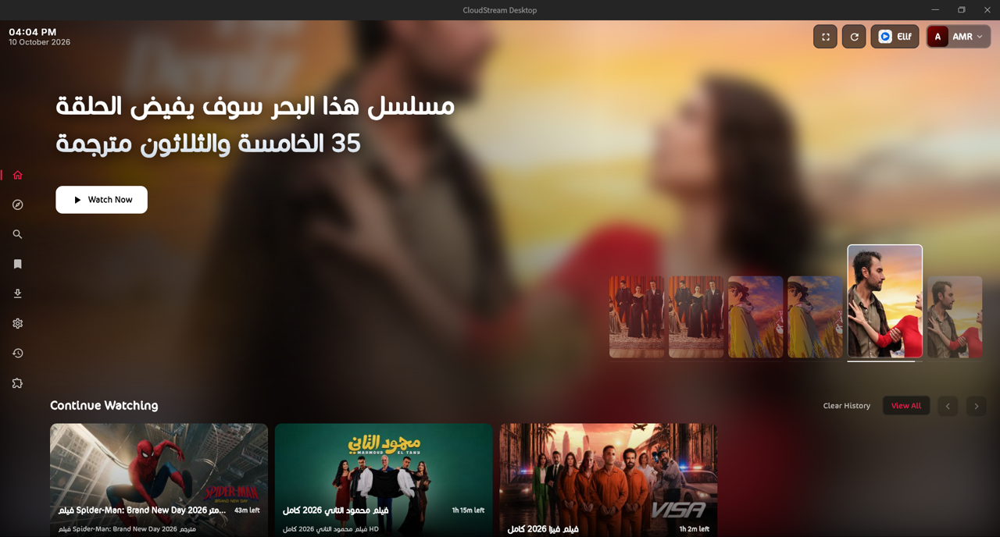
  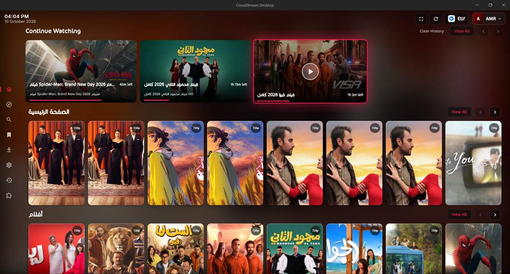
</p>
<p align="center">
  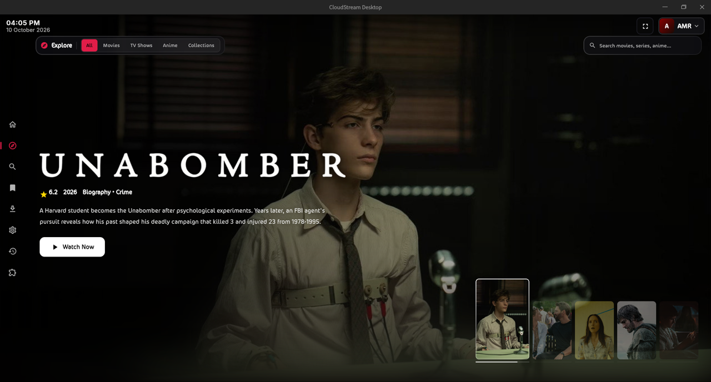
  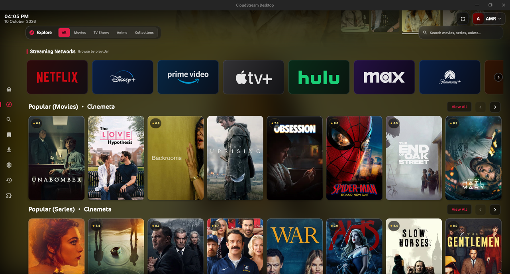
</p>
<p align="center">
  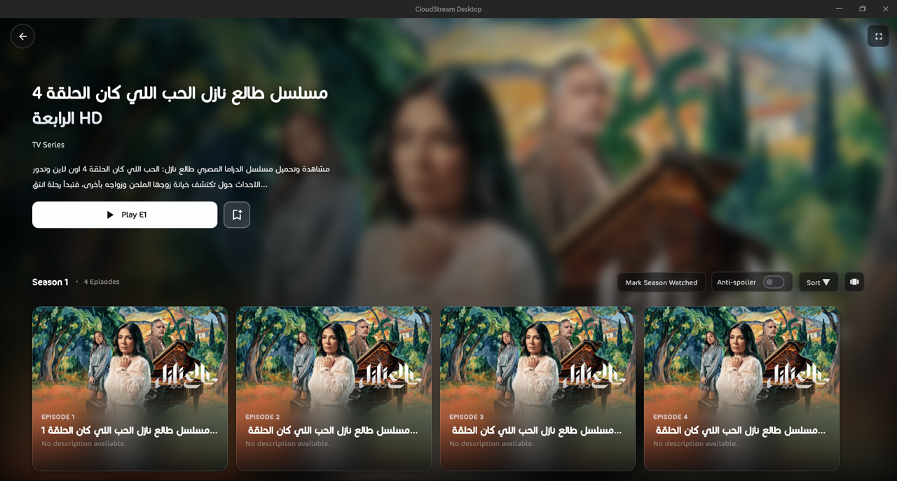
  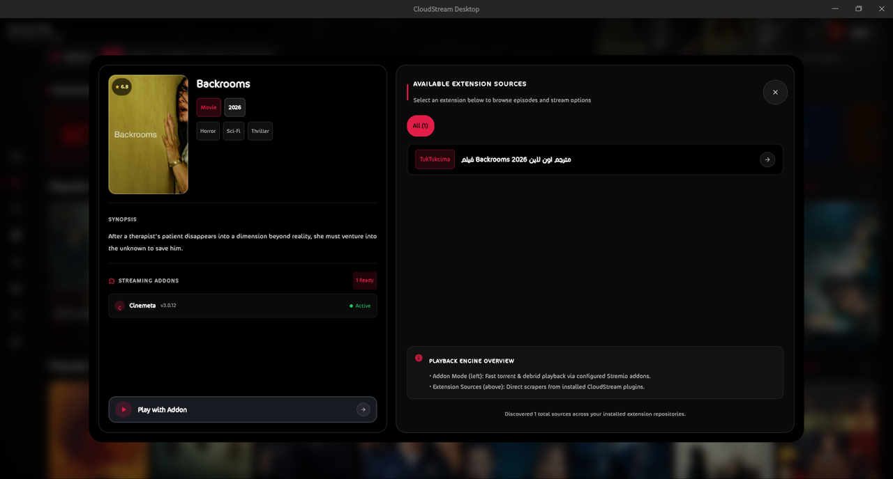
</p>
<p align="center">
  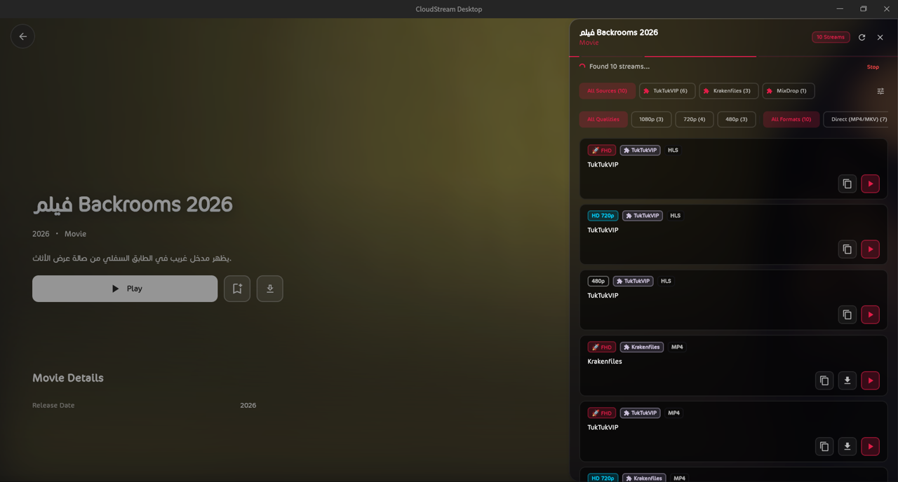
  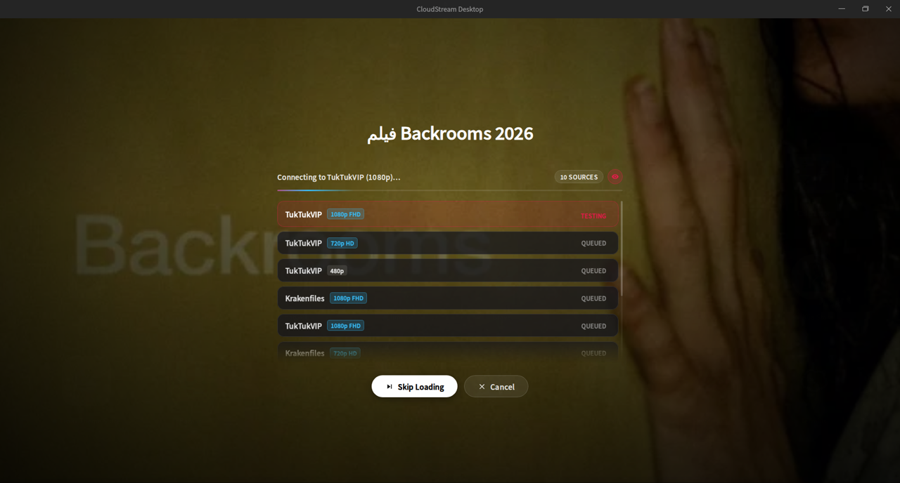
</p>
<p align="center">
  
  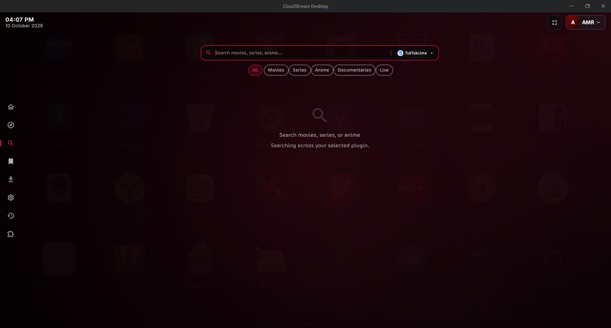
</p>
<p align="center">
  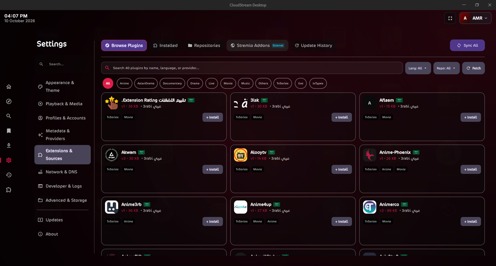
  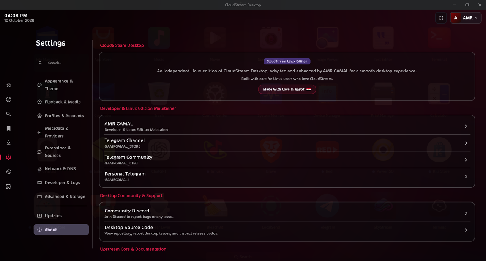
</p>

---

## Features

- Native desktop client (Compose Multiplatform, Amoled dark theme, desktop window controls)
- Runs Android CloudStream extensions on the JVM (DEX-to-JVM transcompilation + sandbox)
- Hardware-accelerated playback via system `libmpv` (sole playback engine)
- Embedded WebKitGTK player surface reusing the shared `player.html` / `player.css` / `player.js`
- Local SQLite persistence (history, preferences, state) via SQLDelight
- `cloudstream --version` / `cloudstream --diagnostics` support commands for bug reports
- Strict Linux-only update channel: only `linux-v<version>` tags from this repository are ever offered as updates

Feature availability may vary by release. Successful application startup does not guarantee that every extension, stream, or media format will work.

## Project Structure

The project is organized into modular components:

| Module | Purpose |
| --- | --- |
| `desktop-app` | Desktop UI, application lifecycle, Linux integration, and media-player integration. |
| `plugin-runtime` | Runtime support for executing compatible Android extension bytecode on the JVM. |
| `player-abstraction` | Media-player abstractions and native playback integration. |
| `android-stubs` | Compatibility implementations for selected Android APIs required by extensions. |
| `common` | Shared application logic and persistence components. |
| `library` | Core interfaces and provider contracts. |

The exact implementation and supported APIs may evolve as Linux support develops.

## Requirements

### Supported architecture

- **x86_64 (64-bit):** Primary Linux target.
- **aarch64 (ARM64):** Experimental; availability depends on the published artifacts and release.

### Runtime requirements

The Linux application may require the following system components, depending on the package format and release:

- JDK 21-compatible runtime or the Java runtime supplied by the application package.
- GTK 3.
- WebKitGTK 4.1.
- libmpv.
- X11 and the required OpenGL/EGL libraries.
- XWayland when running inside a Wayland desktop session.

The native player currently relies on an X11-compatible embedded surface. Wayland desktops therefore require XWayland; native Wayland embedding without XWayland is not currently supported.

Runtime dependencies can vary between distributions and package formats. Consult the release notes and package documentation before installation.

| Library | Purpose |
| --- | --- |
| GTK 3 | Native window / embedded player surface |
| WebKitGTK 4.1 | Embedded WebView player host |
| libmpv (`.so.2` or `.so.1`) | Hardware-accelerated video decoding |
| X11 / OpenGL / EGL | Rendering (`libX11`, `libGL`, `libEGL`) |
| XWayland + `DISPLAY` | Required on Wayland sessions (see below) |

For an exact machine check, run:

```bash
bash desktop-app/check-linux-dependencies.sh
```

The check is soname-based (not package-name-based), so it works across Debian/Ubuntu/Deepin, Fedora, and Arch-style systems. Suggested package groups per family are documented in [`desktop-app/README.md`](desktop-app/README.md).

## Linux Compatibility

Compatibility depends on the host distribution, available system libraries, architecture, and display server.

| Platform | Status | Notes |
| --- | --- | --- |
| Debian 12 and newer | Expected to be compatible with the release baseline | Verify required runtime libraries. |
| Ubuntu 22.04 and newer | CI build baseline | Actual playback and installation should be tested on the target system. |
| Linux Mint 21 and newer | Expected to be compatible | Verify dependencies on the installed release. |
| Deepin | Developer testing environment | Results from one Deepin installation do not establish compatibility with every release. |
| Fedora and compatible distributions | Requires validation | WebKitGTK availability and package dependencies vary. |
| Arch Linux and derivatives | Requires validation | Runtime libraries must match the application's requirements. |
| openSUSE | Requires validation | Verify library availability and package compatibility. |
| ARM64 Linux | Experimental | A successful build does not establish reliable media playback. |

These entries describe the intended compatibility scope, not a claim that every listed distribution has been independently tested.

### Linux ABI baseline

The project's official Linux release workflow is intended to build on Ubuntu 22.04.

The expected baseline is:

- **Architecture:** x86_64.
- **glibc:** 2.35 or newer.
- **libstdc++:** Compatible with the required `GLIBCXX` symbol versions.

These are build-baseline expectations, not a guarantee that every package will run on every distribution meeting those version requirements. Additional runtime libraries may still be required.

For the most reliable results, use the packages published by this repository's release workflow rather than rebuilding the application on a newer host and redistributing the result.

## Installation

Download the latest release from [GitHub Releases](https://github.com/AMRGAMAL-1/CloudStream-Desktop-Linux/releases) (titled `CloudStream <version>`, e.g. **CloudStream 0.1.10**).

Choose a package that matches your Linux distribution and CPU architecture.

The available formats depend on the artifacts successfully produced by each release. Do not assume that every format is available for every version.

```bash
# Debian / Ubuntu / Deepin / Mint
sudo dpkg -i cloudstream-desktop_0.1.10_amd64.deb
cloudstream --version

# Fedora / RHEL-family / openSUSE
sudo rpm -i cloudstream-desktop-0.1.10-1.x86_64.rpm
cloudstream --version

# Portable TAR (any supported distro)
tar -xzf CloudStream-Desktop-0.1.10-linux-x86_64.tar.gz
./CloudStream-Desktop/bin/CloudStream-Desktop --version
# or use the bundled launcher: ./cloudstream --version

# AppImage (any supported distro)
chmod +x CloudStream-Desktop-0.1.10-linux-x86_64.AppImage
./CloudStream-Desktop-0.1.10-linux-x86_64.AppImage --version
```

Uninstall:

```bash
# DEB
sudo dpkg -r cloudstream-desktop

# RPM
sudo rpm -e cloudstream-desktop
```

## Available packages

Every release publishes four artifacts for x86_64 (filenames use the numeric version, e.g. `0.1.10`):

| Format | Filename pattern | Notes |
| --- | --- | --- |
| DEB | `cloudstream-desktop_<version>_amd64.deb` | Technical package ID stays lowercase (`cloudstream-desktop`) so upgrades keep working; installs to `/opt/cloudstream/CloudStream-Desktop`, launcher is `cloudstream` |
| RPM | `cloudstream-desktop-<version>-1.x86_64.rpm` | Same layout and launcher as the DEB |
| TAR.GZ | `CloudStream-Desktop-<version>-linux-x86_64.tar.gz` | Portable; run `CloudStream-Desktop/bin/CloudStream-Desktop` or the bundled `cloudstream` launcher |
| AppImage | `CloudStream-Desktop-<version>-linux-x86_64.AppImage` | Portable; leaves GTK/WebKitGTK, libmpv and GPU drivers host-provided |

The menu entry is **CloudStream Desktop** (`com.cloudstream.CloudStreamDesktop.desktop`). The display name uses the `CloudStream` capitalization; the lowercase `cloudstream-desktop` package ID and `/opt/cloudstream` paths are intentionally kept stable for existing installations.

## Building from Source

### Prerequisites

For a Linux development environment, install:

- Git.
- JDK 21.
- A C/C++ compiler and the native build tools required by the project.
- GTK 3 development files.
- WebKitGTK 4.1 development files.
- libmpv development files.
- pkg-config.

On Debian-based distributions, the common dependencies can be installed with:

```bash
sudo apt update
sudo apt install \
  git \
  openjdk-21-jdk \
  build-essential \
  cmake \
  pkg-config \
  libgtk-3-dev \
  libwebkit2gtk-4.1-dev \
  libmpv-dev
```

Package names may differ on other distributions.

### Clone the repository

```bash
git clone --recursive https://github.com/AMRGAMAL-1/CloudStream-Desktop-Linux.git
cd CloudStream-Desktop-Linux
```

If you already cloned the repository without its submodules, initialize them with:

```bash
git submodule update --init --recursive
```

### Build and test

Run the relevant Gradle tasks:

```bash
./gradlew \
  :plugin-runtime:test \
  :player-abstraction:test \
  :desktop-app:test \
  :desktop-app:linuxNativeBridge \
  :desktop-app:createDistributable \
  --no-daemon -PAPP_VERSION="0.1.10"
```

This command runs the listed test tasks, builds the Linux native bridge, and creates the application distributable.

A successful build does not replace runtime testing. Verify application startup, native-library loading, extension compatibility, and actual media playback separately.

### Check Linux dependencies

The repository provides a dependency-check script:

```bash
bash desktop-app/check-linux-dependencies.sh
```

Run it from the repository root. Review its output before attempting to launch or package the application.

### Build Linux packages

If the distributable has already been built, the packaging scripts can be used to produce the supported package formats:

```bash
SKIP_BUILD=1 bash desktop-app/packaging/build-linux-packages.sh --all
```

Validate the generated runtime image with:

```bash
SKIP_BUILD=1 bash desktop-app/packaging/build-linux-packages.sh --validate
```

The exact output formats depend on the packaging implementation and available build tools.

AppImage generation may require additional tooling. Consult the packaging scripts and release workflow for the requirements of the current version.

To build the JNI bridge manually:

```bash
cd desktop-app/src/main/cpp
JAVA_HOME="$(dirname "$(dirname "$(readlink -f "$(command -v javac)")")")" bash build_jni.sh
```

Run in development mode:

```bash
./gradlew :desktop-app:run
```

The packaged launcher resolves the native bridge from `lib/app/resources/jni/libplayer_bridge.so` inside the runtime image.

## Media Playback

Linux playback uses the project's native player integration and libmpv.

For playback to work correctly, the application must be able to load its native bridge and access the required system libraries.

If the application starts but video playback fails, check the following:

1. Confirm that the native bridge was built for your CPU architecture.
2. Verify that the required native libraries are installed.
3. Run the Linux dependency-check script.
4. Check the application logs for native-library loading errors.
5. Test a known-compatible stream to distinguish player problems from extension or provider problems.

Not every stream, codec, subtitle format, or extension is guaranteed to work.

## Display Server Support

### X11

X11 is the primary display path for the current embedded media surface.

### Wayland

Wayland sessions currently require XWayland for the embedded player surface.

Native Wayland embedding without XWayland is not supported by the current implementation.

If the application fails to display video correctly under Wayland, verify that XWayland is installed and available in the session.

## Updates

Linux builds use this repository's GitHub Releases as their update source.

The Linux update channel is configured through `LINUX_UPDATE_REPO` in:

`desktop-app/src/main/kotlin/com/lagradost/cloudstream3/desktop/AppConfig.kt`

Development builds may support overriding the repository with:

```text
-Dcloudstream.linux.update.repo=owner/repo
```

Linux releases use version tags in the following format:

```text
linux-v<version>
```

For example:

```text
linux-v0.1.10
```

The Linux update channel is separate from the original project's Windows release channel.

Update availability depends on the release metadata, version comparison logic, and successfully published release artifacts.

## Troubleshooting

### The application does not start

- Verify that the package matches your architecture.
- Check that the required runtime libraries are available.
- Run the dependency-check script when working from a source checkout.
- Review the terminal output and application logs for the first meaningful error.

### The native player cannot load

- Confirm that the native bridge exists in the expected package location.
- Check its architecture and shared-library dependencies.
- Verify that libmpv and the required GTK/WebKitGTK libraries are available.

### Video does not appear under Wayland

The current player integration requires an X11-compatible embedded surface. Confirm that XWayland is available and that the application is running with access to it.

### An extension fails to load

The runtime provides compatibility for selected Android APIs, not a complete Android environment. Extensions that depend on unsupported Android APIs, services, WebView behavior, or platform-specific functionality may fail.

### A package fails to install

Check the package architecture and dependency errors reported by your package manager. A portable archive may still require system libraries that are not bundled with the application.

### Codec gaps

Codec support comes from the system GStreamer/FFmpeg packages — install the distribution's normal codec bundle when a preview or stream format is unavailable.

## Development and Contributions

Bug reports and contributions should include enough information to reproduce the issue.

When reporting a Linux-specific problem, provide:

- Linux distribution and version.
- CPU architecture.
- Display server: X11 or Wayland.
- Application version and package format.
- Relevant error messages or logs.
- Steps required to reproduce the problem.

Please avoid including passwords, API keys, access tokens, or other sensitive information in logs and issue reports.

Contributions should preserve the separation between platform-specific implementations and shared application code. Changes to shared modules must be evaluated for unintended effects on other supported build targets.

## License

This project is distributed under the license provided in the repository.

Review the repository's `LICENSE` file for the applicable terms.

## Disclaimer

This application is a desktop client and runtime for compatible CloudStream extensions. It does not itself guarantee the availability or legality of third-party streams or services. It does not host, distribute, or bundle any media content, streams, or scrapers.

Users are responsible for the extensions they install and the content they access. The project does not endorse or guarantee the behavior of third-party extensions.

This is an unofficial community project and is not affiliated with the original CloudStream developers.

## Versioning

- **User-facing version:** numeric, e.g. `0.1.10` (single source of truth: `APP_VERSION` in `gradle.properties`).
- **Git tag:** `linux-v0.1.10` (required by the updater's `linux-v` prefix check — do not change one without the other).
- **GitHub Release title:** `CloudStream 0.1.10`.
- **Artifacts:** `CloudStream-Desktop-0.1.10-linux-x86_64.tar.gz` / `.AppImage`, `cloudstream-desktop_0.1.10_amd64.deb`, `cloudstream-desktop-0.1.10-1.x86_64.rpm`.

## Credits / Acknowledgements

- [CloudStream (Android)](https://github.com/recloudstream/cloudstream) — the upstream Android app whose core library powers this client (unaffiliated; do not contact upstream about this fork).
- [Extension documentation](https://recloudstream.github.io/csdocs/) — plugin development guides and extension APIs.
- Compose Multiplatform, SQLDelight, libmpv, WebKitGTK and the Linux distribution maintainers whose runtimes this client builds on.
- Linux edition maintainer: AMR GAMAL.
